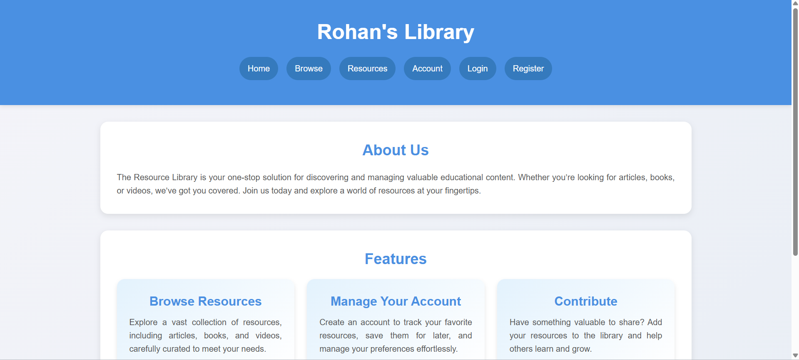
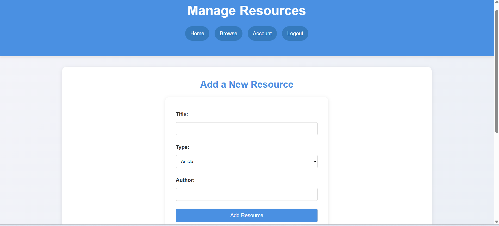
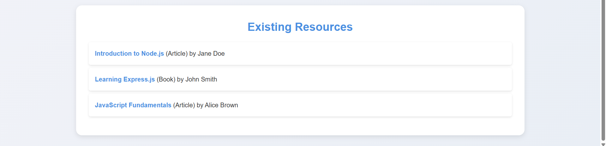

***R Rohan Shalom*** - Generic Tasks Report 
======

------------

## TASK 1: API

Using OpenF1's  Formula One API, I built a website that fetches and displays the details of F1 drivers such as their name, country and team. This task taught me the basics of APIs and how to fetch and display data using JavaScript.
[GitHub](https://github.com/rohgit7/f1api.git)

 

-------------------------
## TASK 2: Working with GitHub

I got hands-on experience with GitHub actions like pull requests, forking, cloning, and committing.
I forked the git-task repository, cloned it, and created a new branch. After fixing an error in the folder, I committed the changes to my forked repository. Then, I pushed the changes and submitted a pull request to merge them with the main branch.

------------------------
## TASK 3:  Get familiar with the command line on ubuntu and do the following subtasks:

I learned to use the command line on Ubuntu for basic tasks like navigating and creating folders or directories. I created three text files namely output.txt, red.text and green.txt, added text to them, and combined their content. I also successfully created 2,600 folders following a specific naming convention.

Concatenation :

Folder Creation: 

---------------------
## TASK 4: Kaggle Contest

I learned how to build a machine learning model using the Titanic survival dataset from Kaggle. I explored the key steps involved, like data cleaning, encoding, training, parameter tuning, testing, and validation.

---------------------
## TASK 5:  Working with Pandas and Matplotlib

I learned to work with the Pandas and Matplotlib libraries using the Gym dataset from Kaggle. I generated scatter graphs, bar graphs and line charts to visualize the data and understood how graphs and charts can help analyze and interpret data more effectively.

Obtained the following plots: 

---------------------
## TASK 6: Create a Portfolio Webpage

Created a simple portfolio webpage using HTML and tailwindCSS. Learned to configure tailwind CSS and push the code to my github repository.

GitHub Link:  [Portfolio](https://github.com/rohgit7/portfolio.git)

---------------------
## TASK 7: Writing Resource Article using Markdown

I learned and used Markdown to write clean and simple formatted text. I became familiar with its syntax, like headers, lists, links, and images, which allowed me to easily create well-structured documents. Markdown helped me write articles for courses like VFX-001 conducted by Marvel.

---------------------
## TASK 8: Tinkercad

I explored Tinkercad by constructing basic circuits, which gave me a solid understanding of electronics. I also developed an ultrasonic radar system using an Arduino UNO, where I gained experience in both circuit building and coding. This project significantly boosted my knowledge of electronics and programming.

---------------------
## TASK 9:  Speed Control of DC Motor

I learned how different hardware components work, like the Arduino UNO, H-Bridge motor driver, and servo motor. Using online code for the Arduino UNO, I built the circuit and was able to control the motor speed with a potentiometer.

---------------------
## TASK 10:  LED Toggle Using ESP32

I learned about the ESP32 microcontroller and built a circuit with a breadboard, jumper wires, resistors, LEDs, and the ESP32. I set it up with Arduino IDE and used online code to create a web server. I could control the LEDs from my phone, and it was a satisfying result.

---------------------
## TASK 11: Soldering Prerequisites

I learned the basics of soldering, including how to use a soldering iron, soldering wick, and flux. Using a perforated breadboard, I soldered a simple LED circuit and a resistor and checked it with a 9V battery.

---------------------
## TASK 12:  Datasheets report writing
I wrote a simple report on the L293D motor driver, explaining its role in controlling motors. The L293D allows direction and speed control of DC motors and stepper motors. I covered its connections and power requirements highlighting its use in robotics and automation projects.

[Report](https://drive.google.com/file/d/1gc0j6jggECxsYhvi2kDWtsu2Re79Y9u0/view?usp=drive_link)

---------------------
## TASK 13: Active Participation:

Participated in Bit N Build Hackathon conducted by GDG UVCE. Built a wardrobe management system.

---------------------
## TASK 14: Karnaugh Maps and Deriving the logic circuit

Truth table:

Logic Circuit: 

---------------------
## TASK 15:  Sad servers - "Like LeetCode for Linux"

The "SAD Servers Command Line Murder Mystery" was a fun and engaging way for me to sharpen my Linux command-line skills. I got to solve a fictional murder case by exploring files, analyzing clues, and narrowing down suspects using commands like `grep`, `cat`, and `ls`. It felt like solving a real puzzle while learning!.

-------------------------------
## TASK 16: Make a Web app

I created a Library Management website using Express.js. It lets users browse resources like articles and books, manage their accounts, and even contribute their own resources. I used EJS for dynamic templates and CSS for styling to make it clean and easy to use. This project helped me improve my backend development skills and build a functional, user-friendly platform.

